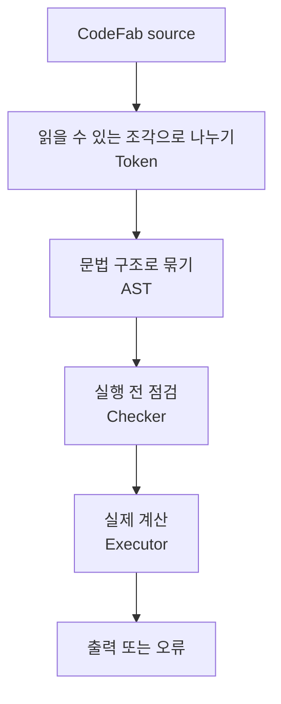

# CodeFab concepts

CodeFab은 작은 custom language를 직접 해석하는 프로젝트다. 사용자는 CodeFab 문법으로 코드를 쓰고,
프로젝트는 그 코드를 읽어 토큰으로 나누고, 문법 트리로 만들고, 실행 전에 위험한 부분을 검사한 뒤 실행한다.

## CodeFab이 해결하는 문제

이 프로젝트의 목적은 완성형 범용 언어를 만드는 것이 아니라, 언어가 동작하는 전 과정을 팀원이 눈으로
따라갈 수 있게 만드는 것이다.

- 문자열이 어떻게 token이 되는지 볼 수 있다.
- token이 어떻게 expression/statement tree가 되는지 볼 수 있다.
- 실행 전에 어떤 오류를 잡을 수 있는지 실험할 수 있다.
- 같은 코드를 prompt, file, debug mode에서 다르게 관찰할 수 있다.

## 한 문장 mental model

CodeFab은 "소스 코드를 AST로 바꾼 다음, checker가 먼저 읽고 executor가 다시 읽는" 트리워킹 인터프리터다.



## 대표 사용자 흐름

### 1. 한 줄씩 실험하기

```bash
make run
```

Prompt shell이 열리면 CodeFab 코드를 한 줄씩 입력한다.

```txt
CodeFab> print 1 + 2;
3
CodeFab> exit
Bye!
```

### 2. 파일로 실행하기

```bash
make run sample.cfab
```

파일 모드는 여러 줄 프로그램을 끝까지 실행하되, 런타임 오류가 발생하면 오류 줄을 알려주고 즉시 멈춘다.

### 3. 디버그하며 관찰하기

```bash
make debug sample.cfab
```

Debug mode에서는 `step`, `next`, `continue`, `break <line>`, `watch <name>`, `inspect` 같은 명령으로
프로그램 상태를 관찰한다.

## CodeFab 코드가 지나가는 네 단계

| 단계 | 사람에게 보이는 의미 | 예시 |
|---|---|---|
| Tokenizer | 문장을 단어와 기호로 나눈다 | `print 1;` -> `PRINT`, `NUMBER`, `SEMICOLON` |
| Assembler | token을 문법 구조로 묶는다 | `PrintStmt(LiteralExpr(1))` |
| Checker | 실행 전에 위험한 코드를 찾는다 | `var a = a;` 같은 자기 참조 |
| Executor | 값을 계산하고 출력한다 | `executor.outputs == ["1"]` |

## 왜 Checker와 Executor가 둘 다 필요한가

Executor만 있어도 코드는 실행할 수 있다. 하지만 checker가 먼저 있으면 "실행하다가 우연히 터지는 오류" 중
일부를 더 친절하게, 더 이른 시점에 설명할 수 있다.

예를 들어 다음 코드는 실행 전에 문제를 설명할 수 있다.

```txt
var a = a;
print a;
```

checker는 `a`가 아직 초기화되기 전에 사용됐다고 판단한다. 이런 방식은 팀원이 "언어 규칙"과
"실행 중 값 계산"을 분리해서 생각하게 해준다.

## CodeFab만의 작은 특징

| 특징 | 설명 |
|---|---|
| `ctrl_c()` | CodeFab 코드 안에서 도움을 요청하고 다음 행동 후보를 확인한다 |
| `explain` | 코드가 어떤 단계로 해석되는지 사람이 읽을 수 있게 보여준다 |
| 한글 키워드 | 영어 키워드를 한글 별칭으로도 작성할 수 있게 한다 |
| line-aware error | 파일/디버그 실행에서 가능한 경우 오류 줄 번호를 보여준다 |
| debug watch | 변수 값을 step마다 관찰할 수 있다 |
| `Array(size)` | native function으로 배열을 만들고 `arr[i]`로 접근한다 |
| `Class`, `This`, `Super` | 클래스, 인스턴스, 상속을 실험할 수 있다 |

## 읽는 순서 추천

| 목적 | 읽을 문서 |
|---|---|
| 처음 이해하기 | `docs/CONCEPTS.md` |
| 언어를 써보기 | `docs/CUSTOMLANGUAGE.md` |
| 구현 구조 파악 | `docs/DETAILS.md` |
| 변경 이력 확인 | `docs/CHANGELOG.md` |
| 문제가 났을 때 | `docs/TROUBLESHOOTING.md` |
