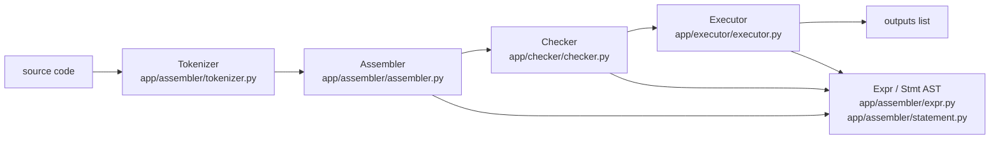
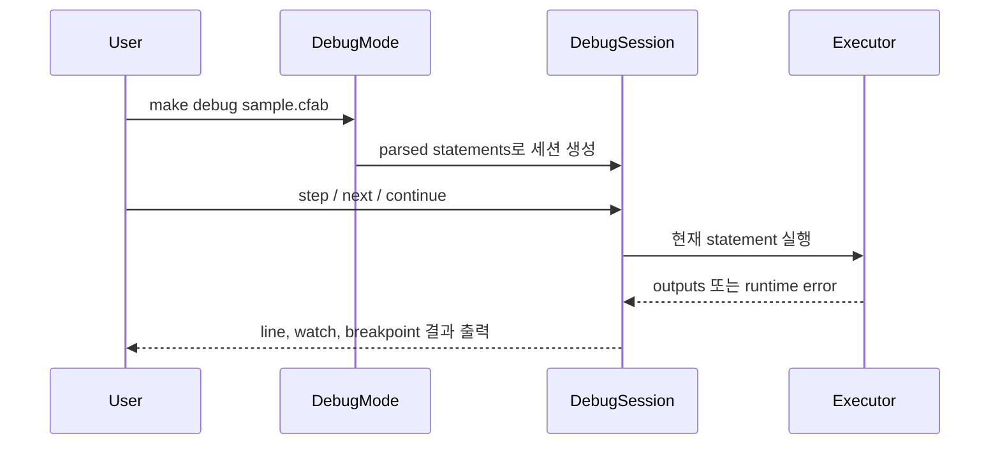

# CodeFab implementation details

이 문서는 CodeFab의 실제 구현 경계와 데이터 흐름을 설명한다. 큰 그림을 먼저 보고 싶다면
`docs/CONCEPTS.md`를 읽고, 언어 문법과 사용 예시는 `docs/custom_language.md`를 함께 보면 된다.

## 한눈에 보는 실행 흐름

사용자가 `make run`, `make run <file>`, `make debug <file>`을 실행하면 결국 `app/main.py`가 모드를 고르고,
각 모드는 같은 파이프라인을 사용한다.

## 패키지 책임

| 영역 | 위치 | 책임 | 읽을 때 확인할 것 |
|---|---|---|---|
| 진입점 | `app/main.py` | CLI 인자를 해석해 prompt, file, debug 모드로 분기 | 인자가 없으면 prompt shell, 첫 인자가 파일이면 file mode |
| Shell | `app/shell/` | 사용자 입력, 파일 실행, 디버그 명령 처리 | `CodeFabRunner`가 공통 실행 파이프라인을 묶는다 |
| Token / AST / Parser | `app/assembler/` | 문자열을 토큰으로, 토큰을 AST로 변환 | `expr.py`, `statement.py`의 노드 계약이 checker/executor의 공통 언어다 |
| 정적 검사 | `app/checker/` | 실행 전 오류 후보를 수집하고 일부 최적화 정보를 AST에 붙임 | 스코프, 함수/클래스 문맥, 초기화 상태를 보수적으로 계산한다 |
| 실행기 | `app/executor/` | AST를 직접 순회하며 값을 계산하고 출력 리스트를 만든다 | 런타임 값, 함수, 클래스, 인스턴스, 배열을 처리한다 |
| 예외 | `app/exceptions.py` | CodeFab 전용 런타임/타입 오류 | line 정보가 있으면 shell/file/debug 모드가 사용자 메시지에 반영한다 |

## 실행 모드

| 명령 | 동작 | 대표 상황 |
|---|---|---|
| `make run` | prompt shell 실행 | 한 줄씩 빠르게 실험 |
| `make run sample.cfab` | 파일 전체 실행 | 발표 예시나 긴 프로그램 실행 |
| `make debug sample.cfab` | 디버그 모드 실행 | 줄 단위 step, breakpoint, watch 확인 |

`PromptShell`은 `ctrlc`와 `ctrlv`라는 프로젝트 고유 명령을 제공한다. 실제 키 입력 조합이 아니라 shell 안에서
입력하는 명령어이며, 최근 history에서 가장 자주 쓴 CodeFab 명령을 추천하고 다시 실행한다.

## 주요 데이터 계약

### Token

`Token`은 `type`, `origin`, 선택적 `value`, `line`을 가진다.

- `origin`: 원본 문자열이다. 예를 들어 식별자 이름이나 연산자 문자를 유지한다.
- `value`: 숫자와 문자열처럼 실행 값으로 바로 쓰는 리터럴에 붙는다.
- `line`: file mode와 debug mode가 오류 위치를 보여주기 위해 사용한다.

숫자는 `float`로 저장하되 출력 시 정수값이면 소수점 없이 보여준다. `01`처럼 0으로 시작하는 숫자와
backslash가 들어간 문자열은 tokenizer 단계에서 막는다.

### AST

AST는 `Expr`와 `Stmt` 계열 노드로 나뉜다.

- 표현식: `LiteralExpr`, `VariableExpr`, `AssignExpr`, `BinaryExpr`, `CallExpr`, `GetExpr`, `SetExpr`,
  `ThisExpr`, `SuperExpr`, `IndexGetExpr`, `IndexSetExpr`
- 문장: `ExpressionStmt`, `PrintStmt`, `VarStmt`, `BlockStmt`, `IfStmt`, `ForStmt`, `FunctionStmt`,
  `ReturnStmt`, `ClassStmt`

checker와 executor는 모두 이 AST를 입력으로 받는다. 따라서 새 문법을 추가할 때는 tokenizer, assembler,
checker, executor, 테스트가 같은 노드 계약을 공유해야 한다.

### Scope와 Environment

정적 검사와 실행은 비슷해 보이지만 서로 다른 저장소를 쓴다.

| 단계 | 저장소 | 목적 |
|---|---|---|
| Checker | `ScopeStack` | 선언 여부, 초기화 여부, 정적 거리(distance), 함수/클래스 문맥 확인 |
| Executor | `Environment` | 실제 런타임 값 저장, 렉시컬 스코프 lookup, distance 기반 빠른 접근 |

checker가 `VariableExpr`와 `AssignExpr`에 `distance`를 붙이면 executor는 `get_at`/`assign_at`으로
바깥 스코프를 더 예측 가능하게 찾는다. distance가 없으면 기존 동적 lookup으로 폴백한다.

## Checker가 막는 대표 오류

| 오류 | 예시 | 이유 |
|---|---|---|
| 같은 스코프 중복 선언 | `var a = 1; var a = 2;` | 같은 블록 안 이름 충돌 |
| 자기 초기화 참조 | `var a = a;` | 값이 준비되기 전에 자기 자신을 읽음 |
| 초기화 전 변수 사용 | `var a; print a;` | 선언만 있고 의미 있는 값이 없음 |
| 함수 외부 return | `return 1;` | 반환할 함수 문맥이 없음 |
| 파라미터 이름 중복 | `Func f(a, a) {}` | 함수 호출 시 인자 매핑이 모호함 |
| 클래스 외부 `This`/`Super` | `print This;` | 인스턴스 문맥이 없음 |
| 자기 자신 상속 | `Class A: A {}` | 상속 그래프가 성립하지 않음 |
| `init`에서 값 반환 | `return 1;` in `init` | 생성자는 인스턴스 초기화 목적 |

checker는 오류 메시지 리스트를 반환한다. 실행 여부는 호출자가 결정하지만, shell/file/debug 흐름에서는
오류가 있으면 executor로 넘어가지 않는다.

## Executor가 처리하는 런타임 값

| 값 | 구현 |
|---|---|
| 숫자 | `int`/`float`를 숫자로 취급하되 `bool`은 제외 |
| 문자열 | `+`로 문자열끼리만 연결 |
| 불리언 | `true`, `false` |
| nil | 내부 값 `None`, 출력은 `nil` |
| 배열 | native function `Array(size)`가 Python list를 만든다 |
| 함수 | `UserFunction`, closure와 parameter binding 보존 |
| 클래스 | `UserClass`, method table, optional superclass |
| 인스턴스 | `UserInstance`, field와 method lookup |

오류는 `CodeFabRuntimeError`로 표현한다. 예를 들어 0으로 나누기, 배열이 아닌 값 indexing,
함수가 아닌 값 호출, 인자 수 불일치, 존재하지 않는 property 접근이 여기에 속한다.

## Debug mode 내부 흐름

Debug mode는 `ForStmt` 전체를 한 번에 실행하지 않는다. `DebugSession`이 `DebugFrame` 스택을 관리하며
블록, if branch, for loop body로 들어갈 수 있게 한다.

`watch`, `inspect`, `break`, `continue`는 executor의 현재 environment를 읽는다. 런타임 오류가 나면
`Token.line` 또는 `Stmt.line`을 이용해 가능한 한 가까운 line 번호를 보여준다.

## CI와 검증 경계

GitHub Actions는 세 흐름으로 나뉜다.

| Workflow | 목적 | 현재 기준 |
|---|---|---|
| Lint | formatting/import/lint 검사 | `black --check .`, `isort --check-only .`, `ruff check .` |
| Unit Tests | 전체 pytest와 coverage | `python -m pytest -q --cov=app` |
| Gist Acceptance | 교안/gist 기반 대표 시나리오 | `tests/test_app_codefab_gist_acceptance.py` |

`app/` 패키지 구조 이후에는 coverage 대상과 acceptance test 파일명을 반드시 `app` 기준으로 맞춰야 한다.
